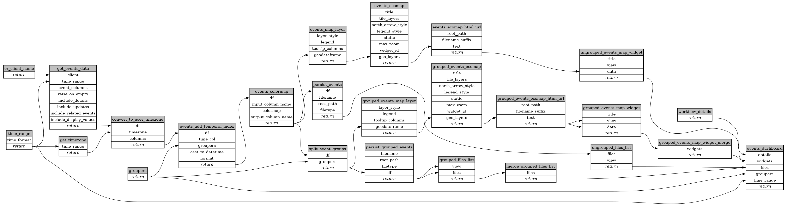

```
# AUTOGENERATED BY ECOSCOPE-WORKFLOWS; see fingerprint in README.md for details

```

```yaml
# fingerprint:
artifacts_sha256_basic: 051a616b75d8c9bac31b88798d66c3b48cda6f9a4bd220c8d353f513e403f530
artifacts_sha256_strict: ca59e83001621b9c09ae44dad753dd615d49f781765d8be7a2d98c6bfc951d12
installed_requirements:
- channel: https://repo.prefix.dev/ecoscope-workflows/
  name: ecoscope-platform
  version: {version: ==2.18.0}
- channel: conda-forge
  name: pydeck
  version: {version: ==0.9.2}
params_sha256: 67fcb841ad59057d1046e3edb71e762e55cd9d4289e123fb22350a4c78b9f674
spec_sha256: 8b6690ca08f63a61824ce616fffb26512896a4bf124a30f39e00daf6db6dc0ce

```

# ecoscope-workflows-test-dashboard-workflow


